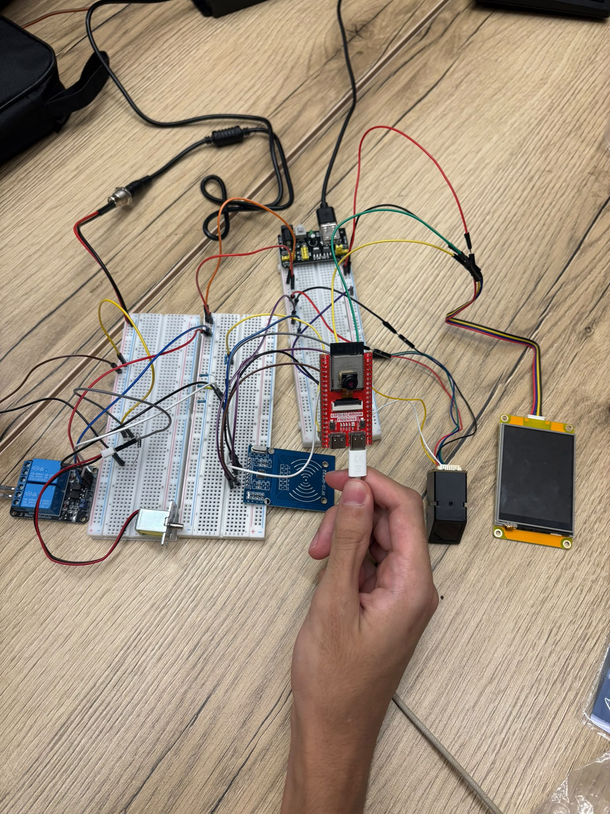
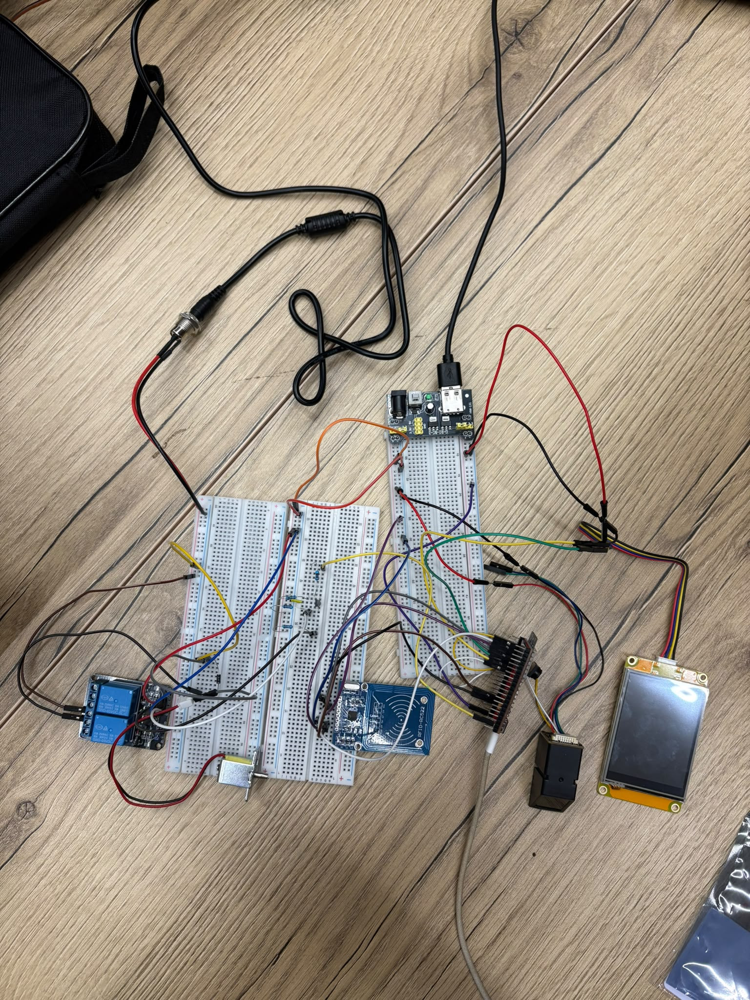
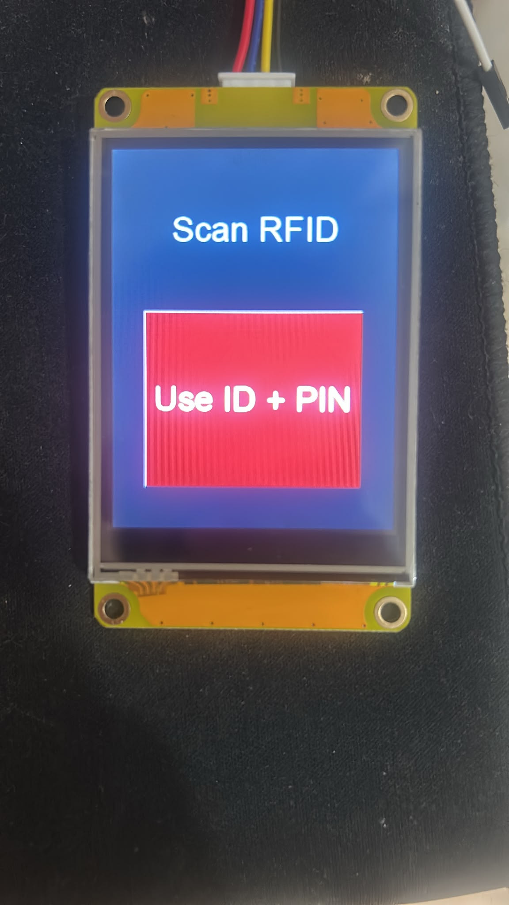
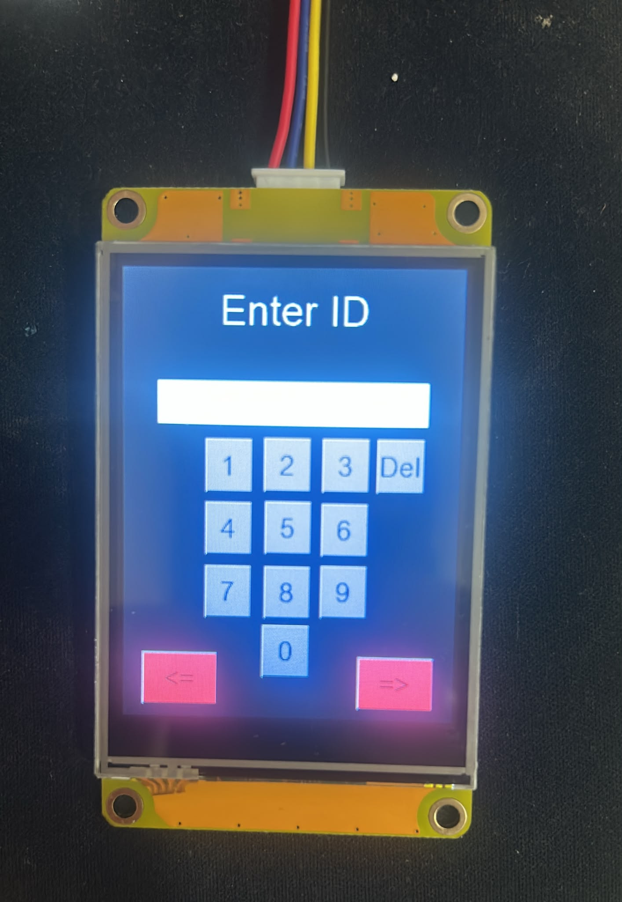
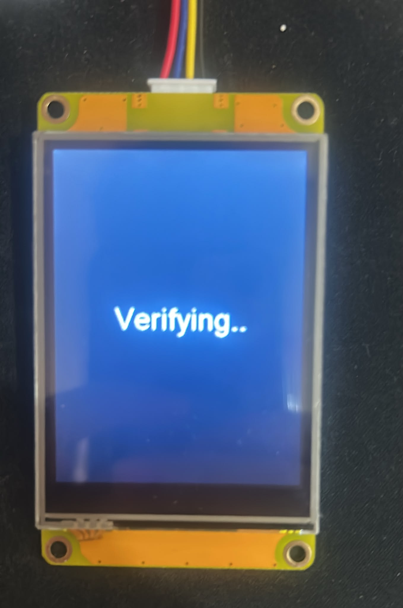
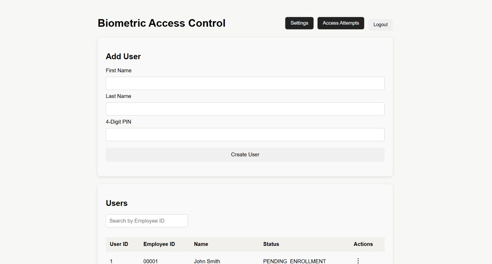
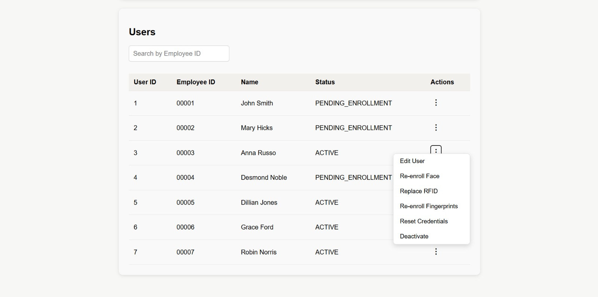
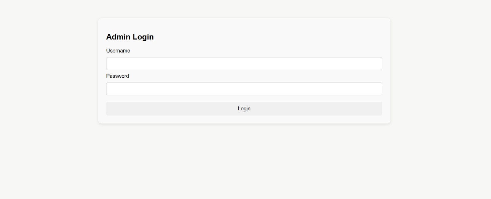
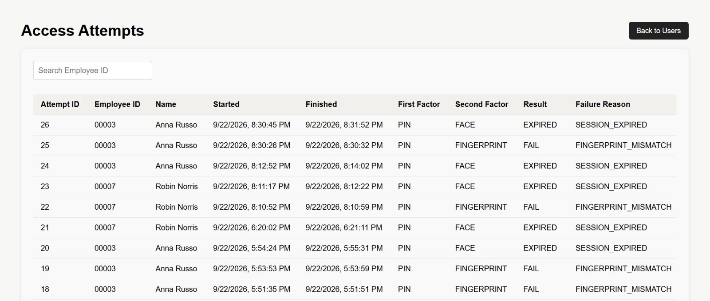
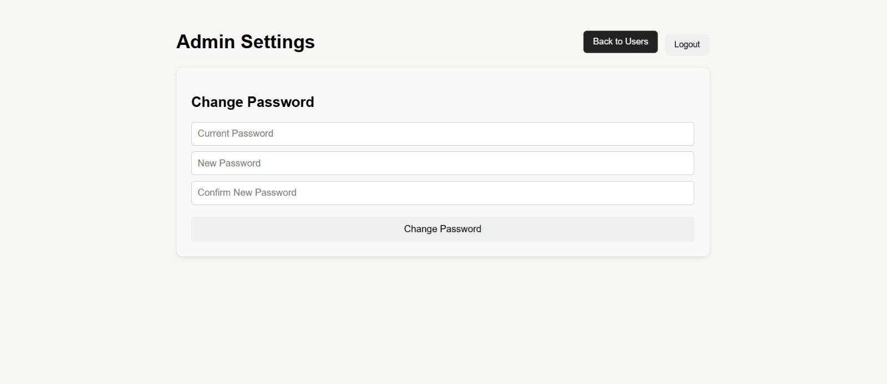

# Biometric Access Control System

A single-kiosk access-control prototype combining an **ESP32-S3**, RFID, a Nextion touchscreen, face recognition, and fingerprint verification. The ESP32 handles the sensors and user interaction, while a cloud-hosted **FastAPI** backend manages users, verifies credentials, coordinates enrollment, and records access attempts in **PostgreSQL**.

The project brings together embedded firmware, physical access-control hardware, biometric verification, and a browser-based administrator dashboard. The hardware and software were developed as a connected prototype rather than as separate demonstrations.

## How It Works

A user starts by scanning an RFID card or entering a **five-digit employee ID and four-digit PIN** on the touchscreen. Once the first factor is accepted, the backend randomly selects **face** or **fingerprint** verification as the second factor. The ESP32 follows the backend's response to complete the requested step and handle the authentication result.

- **Face verification:** The ESP32 captures a JPEG image, performs initial face checks and cropping, and uploads the image to the backend. InsightFace produces a face embedding, which is compared with the enrolled representation for the expected user.
- **Fingerprint verification:** The AS608 sensor stores and matches fingerprint templates locally. It returns the matched template slot, and the backend verifies that the slot belongs to the user identified by the first factor.

First-time enrollment follows **RFID → five face captures → two fingerprints**. Administrators can also request replacement of an existing user's RFID card, face credential, or fingerprints. The replacement itself takes place at the kiosk.

```text
                    Administrator
                         |
                    Web dashboard
                         | JWT
                         v
ESP32 kiosk ------> FastAPI backend <------> PostgreSQL
RFID / ID + PIN     API and workflow        Users / credentials
AS608 / camera      In-memory sessions      Admins / access logs
Nextion screen            |
                          +---> OpenCV / InsightFace
                          |     Face verification
                          |
                          +---> flow + next_step ---> ESP32
```

Authentication and enrollment sessions are held in backend memory; they are not stored in PostgreSQL. The database stores fingerprint **slot mappings**, while the actual fingerprint templates remain on the AS608 sensor.

## Prototype Photos and Screenshots

### Hardware Prototype

The prototype connects the ESP32-S3 camera board, RC522 RFID reader, AS608 fingerprint sensor, Nextion display, and relay/solenoid circuit through a breadboard-based setup.

| Connected prototype | Wiring and component layout |
|:---:|:---:|
|  |  |

For pin assignments and power distribution, see the [hardware wiring documentation](hardware/wiring/PINOUT_AND_POWER.md).

### Nextion Touchscreen

The display provides the RFID/ID entry options, on-screen keypad, and feedback while the kiosk waits for verification.

| Start screen | Employee ID entry | Verification |
|:---:|:---:|:---:|
|  |  |  |

### Administrator Dashboard

The dashboard is used to create accounts, review user status, request credential reenrollment, inspect access attempts, and change the administrator password. It communicates with FastAPI rather than directly with the sensors.

**User management and credential actions**

| Create a user and view accounts | Edit, deactivate, or request reenrollment |
|:---:|:---:|
|  |  |

**Login and access history**

| Administrator login | Recorded access attempts |
|:---:|:---:|
|  |  |

**Administrator settings**



## Hardware

| Component | Role |
| --- | --- |
| Freenove ESP32-S3-WROOM | Main controller, firmware execution, and Wi-Fi connection |
| ESP32-compatible camera module | Captures face images for upload to the backend |
| Nextion touchscreen | RFID/ID entry, PIN entry, prompts, and verification feedback |
| RC522 RFID reader | Reads RFID card UIDs |
| AS608 fingerprint sensor | Enrolls, stores, and matches fingerprint templates |
| 5 V relay module and 12 V solenoid lock | Physical lock-release hardware |
| S8050 NPN transistor, resistors, and 1N4007 diode | Relay interface and flyback protection |
| HW-131 power module, adapters, and wiring | Power distribution and connections |

The exact pinout, electrical notes, firmware, and display project are documented in [`hardware/`](hardware/README.md).

## Software

| Area | Tools |
| --- | --- |
| ESP32 firmware | C++, Arduino-ESP32, FreeRTOS, PlatformIO |
| Touchscreen | Nextion Editor |
| Backend API | Python, FastAPI, Uvicorn |
| Face verification | InsightFace, OpenCV, NumPy, ONNX Runtime |
| Database | PostgreSQL, psycopg |
| Administrator dashboard | HTML, CSS, JavaScript |
| Communication | HTTPS, JSON, multipart JPEG uploads, and Nextion serial communication |
| Cloud deployment | Railway |

## Repository Structure

| Directory | Contents |
| --- | --- |
| [`backend/`](backend/README.md) | FastAPI routes, authentication and enrollment services, administrator functions, and cloud setup |
| [`dashboard/`](dashboard/README.md) | Administrator interface and its integration with the API |
| [`database/`](database/README.md) | PostgreSQL schema and entity-relationship diagram |
| [`hardware/`](hardware/README.md) | ESP32 firmware, Nextion HMI project, wiring, and hardware documentation |
| [`ml/`](ml/README.md) | Face-recognition methodology, two offline experiments, graphs, and threshold selection |
| [`images/`](images/) | Prototype photographs and interface screenshots shown above |

## Setup and Installation

The backend was deployed with **Python 3.13** and uses the dependency versions pinned in [`requirements.txt`](requirements.txt). Run the Python commands from the **repository root**.

### Prerequisites

- Git, Python 3.13, and PostgreSQL
- [PlatformIO for VS Code](https://platformio.org/install/ide?install=vscode) to build and upload the ESP32 firmware
- [Nextion Editor](https://nextion.tech/nextion-editor/) to compile the touchscreen project

### 1. Clone the Repository

```bash
git clone https://github.com/mjdakkak/Biometric_Access_Control_System.git
cd Biometric_Access_Control_System
```

### 2. Set Up PostgreSQL

Create an empty PostgreSQL database and apply the [database schema](database/schema.sql):

```bash
psql -h YOUR_HOST -U YOUR_USER -d YOUR_DB_NAME -f database/schema.sql
```

The schema creates the tables and employee-ID sequence. It does not create an administrator account or enroll physical credentials. See the [database README](database/README.md) for details.

### 3. Set Up the Backend

Create a virtual environment and install the project's dependencies:

```bash
python -m venv .venv
python -m pip install -r requirements.txt
```

Activate the environment before installing or running the application: on Windows PowerShell use `.\.venv\Scripts\Activate.ps1`; on Linux or macOS use `source .venv/bin/activate`.

Copy [`.env.example`](.env.example) to `.env` and configure the PostgreSQL connection, `JWT_SECRET`, and `DEVICE_API_KEY`. Do not commit real passwords or API keys. Create the first administrator using the local procedure in the [backend setup guide](backend/README.md#4-create-the-first-administrator).

Start the application:

```bash
python -m uvicorn backend.main:app --reload
```

The API runs at `http://127.0.0.1:8000`. Open `/docs` for the interactive API reference and `/dashboard/login.html` for the administrator login page.

### 4. Set Up the Kiosk

Open [`hardware/firmware/`](hardware/firmware/) in VS Code with PlatformIO. Copy `hardware/firmware/src/secrets.h.example` to `hardware/firmware/src/secrets.h`, then configure the Wi-Fi credentials, backend URL, and device API key. Build and upload the firmware to the ESP32-S3.

Open [`hardware/nextion/nextionScreen.HMI`](hardware/nextion/nextionScreen.HMI) in Nextion Editor and compile the display project. Follow the [hardware setup instructions](hardware/README.md) to load it onto the touchscreen and connect the peripherals.

## Testing and Results

The API workflows were tested before integrating the physical kiosk. Hardware integration then covered input from the Nextion display, RFID, fingerprint enrollment and matching, camera capture and upload, backend workflow responses, user activation, and access-attempt logging. The relay and solenoid are part of the hardware prototype; a backend authentication `SUCCESS` is an approval decision and, by itself, is not proof of physical lock actuation.

Face verification was evaluated separately using the **CMU Multi-PIE** dataset. Two offline experiments compared embedding distances for images of the same person and of different people, with the second experiment introducing greater image variation. The [ML README](ml/README.md) includes the numerical results, graphs, and the distinction between the experimental threshold and the setting used by the deployed backend.

For hardware integration notes, see the [test-status document](hardware/docs/TEST_STATUS.md).

## Project Roles

This was a collaborative hardware/software project with the following division of responsibilities:

- **Electrical and embedded systems:** ESP32 firmware, sensor integration, Nextion communication, wiring and power distribution, and relay/lock control.
- **Backend and application software:** FastAPI services, PostgreSQL schema, administrator dashboard, server-side face verification and ML evaluation, and Railway deployment.

## Status and Scope

This is a **functional single-kiosk prototype**, developed to demonstrate credential enrollment, two-factor authentication, user administration, and coordination between physical sensors and a cloud backend. It is not certified for security-critical building access.

The current version does not include remote unlocking from the dashboard, dedicated face-liveness detection, or automatic recovery from every interrupted fingerprint operation. Temporary sessions are held in backend memory and are lost if the server restarts. The [backend](backend/README.md) and [hardware](hardware/README.md) documentation describe the implementation and integration details.
