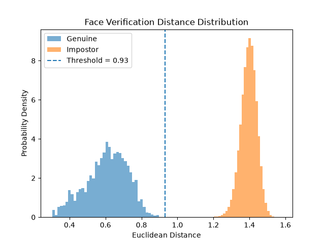
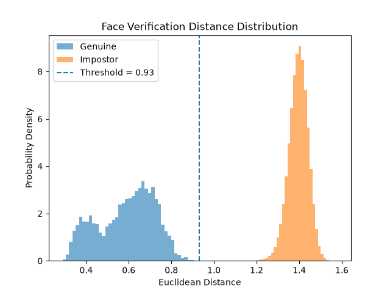

# Face Recognition Evaluation

This folder documents how the project evaluated **face verification** before integrating it with the biometric access control system. It uses the pretrained InsightFace `buffalo_l` model; **no neural network was trained from scratch**. The work focused on extracting face embeddings, comparing images of the same and different people, examining the distance distributions, and selecting a practical backend threshold.

The two graphs below are **distance-distribution plots**, not training or accuracy graphs. They show what happened with the images evaluated in these experiments, not how the model will perform for every person or camera condition.

## Contents

- [Role in the access-control system](#role-in-the-access-control-system)
- [How verification works](#how-verification-works)
- [Experiment 1: controlled conditions](#experiment-1-controlled-conditions)
- [Experiment 2: increased variation](#experiment-2-increased-variation)
- [Comparison and threshold selection](#comparison-and-threshold-selection)
- [Deployed enrollment and authentication](#deployed-enrollment-and-authentication)
- [What the experiments establish](#what-the-experiments-establish)
- [Limitations and next steps](#limitations-and-next-steps)

## Role in the access-control system

Face recognition is one possible **second authentication factor**. The first factor—RFID, or the fallback employee ID and PIN—establishes the expected user. The backend randomly chooses `FACE` or `FINGERPRINT`, and if face is selected, it compares the captured image only against that user's enrollment representation. This is **one-to-one verification**, rather than identifying an unknown person from every record in the database.

```text
RFID or employee ID + PIN
           |
    Expected user known
           |
       FACE selected
           |
    ESP32 image upload
           |
     InsightFace model
           |
     Embedding comparison
           |
       Accept / reject
```

## How verification works

### Face embeddings

InsightFace detects the face and produces a **512-dimensional embedding**: a numeric vector representing features learned by the pretrained model. The experiments used InsightFace's normalized embeddings, so vectors can be compared on a consistent scale. They do not compare photographs pixel by pixel.

### Euclidean distance

For two embeddings, the Euclidean distance is the square root of the sum of their squared component-by-component differences:

```text
distance = sqrt(sum((embedding_A[i] - embedding_B[i]) ** 2))
```

A **smaller** distance means the model produced more similar face representations. A **larger** distance means the representations differ more.

### Genuine and impostor pairs

- **Genuine comparison:** two images belonging to the *same* person. The desired distance is relatively small.
- **Impostor comparison:** images belonging to *different* people. The desired distance is relatively large.

The key question is whether there is a gap between the **largest genuine distance** and the **smallest impostor distance**. If the two ranges overlap, some decisions become more difficult. The experiment-specific gaps below measure the separation observed in the evaluated images.

## Experiment 1: controlled conditions



### Objective

Establish a baseline for the model with multiple head views but a common lighting condition. The goal was to see whether same-person distances stayed below different-person distances under relatively controlled acquisition.

### Images and procedure

The recorded experiment used **249 subjects**, with these five view codes for each subject: `051`, `140`, `050`, `130`, and `041`. Lighting condition `06` was held constant. These codes come from the experiment's image naming/selection scheme; the available project notes do not identify the dataset's formal name or define every view code, so they should not be expanded into invented pose descriptions.

Each selected image was processed with InsightFace to obtain its normalized embedding. Distances between images of the **same subject** were collected as genuine comparisons; distances between images of **different subjects** were collected as impostor comparisons. The reported counts correspond to comparing every distinct image pair within each identity and every image combination between different identities:

```text
249 subjects × 10 same-person pairs = 2,490 genuine comparisons
249 × 248 / 2 subject pairs × 5 × 5 image pairs = 771,900 impostor comparisons
```

Those calculations explain the reported comparison counts; they do not independently verify the original experiment script or how unsuccessful detections, if any, were handled.

### Results

| Measurement | Genuine pairs | Impostor pairs |
| --- | ---: | ---: |
| Number of comparisons | 2,490 | 771,900 |
| Minimum distance | 0.2735 | 1.0593 |
| Average distance | 0.4862 | 1.3947 |
| Maximum distance | 0.8133 | 1.5783 |

The most difficult observed genuine comparison was **0.8133**, while the closest observed pair of different identities was **1.0593**. The difference between them was approximately **0.246** distance units.

### How to read the graph

The **genuine distribution** lies on the lower-distance side of the figure; the **impostor distribution** lies on the higher-distance side. The gap between their observed extremes means that a threshold placed inside that interval would separate all comparisons in **this particular experiment**.

The averages alone are not enough to make this decision. The genuine average (**0.4862**) describes a typical same-person comparison, but legitimate comparisons were also recorded as high as **0.8133**. Similarly, the average impostor distance (**1.3947**) is much less important to threshold selection than the *closest* different-person pair at **1.0593**.

## Experiment 2: increased variation



### Objective

Evaluate whether the separation observed in Experiment 1 remains when the images are less consistent, particularly with more varied lighting/capture conditions. The aim was to test a harder same-person comparison, because a kiosk user's authentication image will not look exactly like the enrollment images every time.

### Procedure and recorded results

The project records identify this as the **varied-lighting experiment**, but the exact additional lighting codes and the complete image-selection procedure were not retained in the supplied documentation. It should not be presented as a fully reproducible study until those details are recovered from the original experiment script or dataset.

The recorded results are:

| Measurement | Recorded value |
| --- | ---: |
| Average genuine distance | 0.589 |
| Maximum genuine distance | 0.906 |
| Minimum impostor distance | approximately 1.059 |
| Gap between those extremes | approximately 0.153 |

Other summary values and comparison counts for this run are not available in the current records and are intentionally omitted.

### How to read the graph

Compared with Experiment 1, the genuine comparisons moved toward **larger distances**. The same person's images became less similar to the model as acquisition conditions varied. The maximum recorded genuine distance rose from **0.813** to **0.906** and the mean from **0.486** to **0.589**.

The closest reported impostor remained near **1.059**, so the observed gap became **smaller**, shrinking from about **0.246** to **0.153**. The genuine and impostor ranges still did not overlap in this recorded experiment, but the reduced margin illustrates why the threshold cannot be chosen using only controlled images.

## Comparison and threshold selection

| Result | Experiment 1 | Experiment 2 |
| --- | ---: | ---: |
| Average genuine distance | 0.486 | 0.589 |
| Maximum genuine distance | 0.813 | 0.906 |
| Minimum impostor distance | 1.059 | ~1.059 |
| Observed separation | ~0.246 | ~0.153 |

### Candidate threshold on the graphs

The development plots mark a candidate threshold near **0.93**. Both experiments recorded genuine distances below this value and impostor distances above it. This makes it a useful *illustrative decision boundary for the recorded image pairs*, not a guaranteed threshold for all people or future captures.

### Threshold used by the backend

The backend uses `FACE_THRESHOLD = 0.95` with the decision:

```text
distance <= 0.95  -> accept face match
distance > 0.95   -> reject face match
```

This value remains above the largest genuine distance observed in Experiment 2 (**0.906**) and below its reported smallest impostor distance (**1.059**). Relative to these observed extremes, it leaves about **0.044** above the genuine maximum and **0.109** below the impostor minimum.

A higher threshold gives a legitimate user more tolerance for changes in their image, but also accepts more similarity between different people. A lower threshold does the opposite. The chosen value is a **project-specific engineering setting informed by the development experiments**. The experiments do not prove that it is universally optimal.

## Deployed enrollment and authentication

The offline experiments compare embeddings from **individual images**. The deployed enrollment process is different: it builds one stored representation from **five images** captured at prompted head positions. The two methods should not be described as though the experimental distances directly measure the deployed averaged-template pipeline.

### Five-capture enrollment

The kiosk requests the following head positions:

1. `LOOK_STRAIGHT`
2. `TURN_SLIGHTLY_LEFT`
3. `TURN_MORE_LEFT`
4. `TURN_SLIGHTLY_RIGHT`
5. `TURN_MORE_RIGHT`

For each accepted image, the backend extracts a normalized 512-dimensional embedding. In the available enrollment code, it then **averages the five embeddings and normalizes the average again** before storing it in PostgreSQL. The intention is to include several head orientations in the user's enrolled representation; a direct performance advantage over one-image enrollment was **not separately tested** in the two graphs.

### Authentication capture

At authentication, the ESP32 sends a new camera image. The backend decodes it with OpenCV, generates an InsightFace embedding, loads the expected user's stored enrollment embedding, calculates Euclidean distance, and applies the configured threshold.

```text
Five enrollment images                    Authentication image
           |                                      |
  five normalized embeddings               normalized embedding
           |                                      |
   average and re-normalize                        |
           |                                      |
  stored enrollment vector ------------ Euclidean distance
                                                  |
                                          compare to 0.95
                                                  |
                                            accept / reject
```

Actual ESP32 captures matter because the embedded camera may differ from the offline dataset in lighting, framing, compression, sharpness, and cropping. Hardware testing confirmed that the camera/upload/backend path was integrated after an initial camera issue was fixed; the offline plots are **not** a quantitative study of accuracy on ESP32 images.

## What the experiments establish

The recorded results support three limited conclusions:

1. **Controlled comparisons separated:** Experiment 1 recorded a gap of approximately **0.246** between its largest genuine and smallest impostor distances.
2. **Variation made genuine matching harder:** Experiment 2 increased the largest genuine distance to about **0.906**, reducing the observed gap to approximately **0.153**.
3. **A decision boundary was plausible for the evaluated image pairs:** the experimental threshold near **0.93** and deployed setting **0.95** both fall between the recorded Experiment 2 extremes.

These conclusions apply to the evaluated pairs. They do not establish a general acceptance or rejection rate for unseen users, and they do not prove that every physical kiosk capture will match.

## Limitations and next steps

- **Dataset details:** the formal dataset name/source, license, exact view-code meanings, and Experiment 2 sample selection must be added from the original source or experiment script if the evaluation is to be reproduced independently.
- **Capture conditions:** offline dataset images do not reproduce every lighting, pose, camera, or framing condition at the physical kiosk.
- **Method difference:** the graphs use image-to-image distances, whereas the deployed system compares an authentication embedding with an averaged enrollment representation.
- **Threshold validation:** the reported threshold was investigated using development data; a separate, more varied evaluation would be needed to assess its behavior beyond those comparisons.
- **Liveness:** the project implements **face verification**, not dedicated liveness or photo/screen-attack detection.

Possible next steps include collecting more consented ESP32 captures, recording distances from actual kiosk attempts, comparing single-image and five-image enrollment, and testing more lighting and appearance changes. No further ML features are required to understand the current prototype.

## Related documentation

- [Backend and API](../backend/README.md)
- [Database](../database/README.md)
- [Dashboard](../dashboard/README.md)
- [Hardware and firmware](../hardware/README.md)
